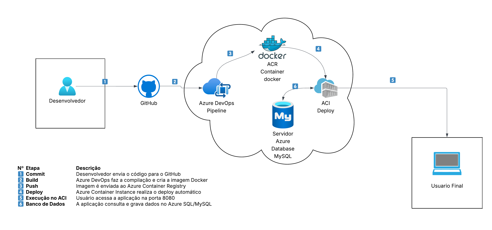

# 🛡️ WorkingSafe – Plataforma de Bem-Estar e Gestão de Burnout  
### DevOps – Azure Repos | Pipelines | ACR | ACI | Azure SQL  
**Integrantes:**  
- Leonardo Bianchi – RM558576  
- Mateus Teni Pierro – RM555125  
- Heitor Romero – RM557825  

---

# 📌 1. Conceito do Projeto

O **WorkingSafe** é uma plataforma corporativa voltada para monitoramento de bem-estar e risco de burnout em equipes remotas e híbridas.  
O sistema permite que colaboradores registrem **check-ins diários** com humor, foco, pausas, horas trabalhadas e observações.  
A API também fornece dados agregados para **gestores**, respeitando anonimização e boas práticas de psicologia organizacional.

A arquitetura é composta por:
- API Java (CRUD + segurança)
- Banco **Azure SQL**
- Deploy automatizado no **Azure Container Instances**
- Build + Push no **Azure Container Registry**
- CI/CD completo com **Azure Pipelines**

---

# 📌 2. Arquitetura Geral



### 🔄 Fluxo CI/CD
1. Commit no Azure Repos  
2. Build no Azure Pipelines  
3. Push da imagem para o ACR  
4. Deploy automatizado via Release usando Azure CLI  
5. Execução no ACI (porta 8080)  
6. Persistência no Azure SQL Database  

---

# 📌 3. Estrutura do Repositório

```
/scripts
  ├── script-infra-workingsafe.sh      # Criação via CLI do RG, ACR, ACI e SQL
  ├── script-bd.sql                    # Criação das tabelas
  ├── crud-usuarios.json               # Exemplos de CRUD em JSON

/dockerfiles
  ├── Dockerfile

azure-pipelines.yml                    # Pipeline de Build (CI)
README.md                              # Este arquivo
```

---

# 📌 4. Scripts de Infraestrutura

Todos os recursos foram criados usando Azure CLI:

✔ Resource Group  
✔ ACR  
✔ ACI  
✔ Azure SQL Server e Database  

O script está na pasta `/scripts`.

---

# 📌 5. CRUDs em JSON (exigência do professor)

## **Usuários – /api/usuarios**

### ➤ GET – Listar usuários
```json
GET /api/usuarios
```

### ➤ POST – Criar usuário
```json
{
  "nome": "Ana Gestora",
  "email": "ana.gestora@techmind.com",
  "empresaId": 1,
  "timeId": 1,
  "ativo": true
}
```

### ➤ PUT – Atualizar usuário
```json
{
  "id": 1,
  "nome": "Ana Gestora Atualizada",
  "email": "ana@empresa.com",
  "ativo": true
}
```

### ➤ DELETE
```
DELETE /api/usuarios/1
```

---

# 📌 6. Execução do Projeto

A API roda automaticamente após o deploy no ACI:

```
http://aci-workingsafe-XXXX.eastus.azurecontainer.io:8080
```

---

# 📌 7. Pipeline (CI) – Azure Pipelines

- Build da API  
- Gerar imagem Docker  
- Push para o ACR  
- Publicar artefato build-info.txt  
- Executar testes unitários (quando aplicável)

Arquivo YAML: `azure-pipelines.yml`

---

# 📌 8. Pipeline (CD) – Release

- Busca automaticamente o artefato  
- Executa Azure CLI  
- Instancia container no ACI  
- Define DNS público  
- Conecta ao Azure SQL  

---

# 📌 9. Boards – Rastreabilidade

Todos os commits, branches e PRs foram vinculados a Work Items.  
A branch **main** é protegida com:

✔ Revisor obrigatório  
✔ Work Item obrigatório  
✔ PR obrigatório  

---

# ✔ Projeto finalizado seguindo 100% dos requisitos da GS DevOps.

